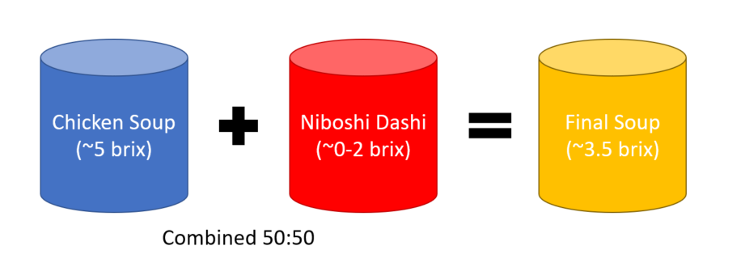
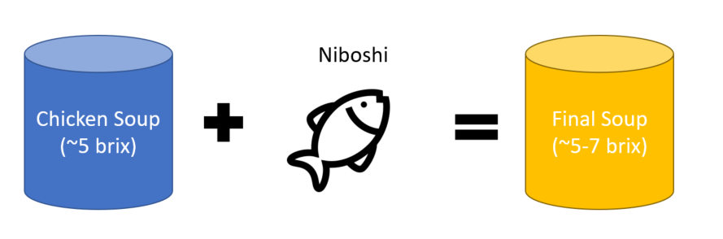

# Additional Techniques for Soup

Most of the recipes shown were done in one pot, or don't remove any impurities
beyond skimming and straining. Sometimes you may want to combine flavors from
two differently cooked products, or you may want to further clarify the soup.
I'll discuss techniques for both interests next. 

## Double Soup

Around the turn of the 2000s, a relatively new method of combining separate
soups just before serving emerged, called the "double soup" method. This
approach is unique in that it takes essentially two soups that have been cooked
separately, and combines them. 

The theory behind this technique is that by cooking different ingredients
separately, and then combining, you have more control over the specific outcomes
of each part. A vegetable soup can be cooked at a specific temperature and time,
a meat soup at different conditions, a dashi at different conditions, etc. Then
they're chilled and combined once reheated. The main consideration for any cook
with this approach is just dilution. When combining dashi with meat soup, as an
example, the amount of water dramatically increases, reducing final gelatin
content. This also grants a cook a lot of control if they've prepared a lot of
parts to work with.

Consider the following example:

The above soup declines in Brix due to the dilution from the dashi. This can be
compensated for by increasing the relative gelatin content of the Chicken Soup,
either by reducing the amount of water used or increasing the amount of chicken.
But this may not be possible if the water doesn't cover the bones. At home, this
is mitigated easily by just combining all ingredients in one pot. So this tends
to be my approach: 

In my opinion, the double soup method is better suited for restaurants than home
cooks, primarily because it allows for separation of complex tasks in a busy
kitchen, and to help scale down the volume of soup made. Rather than making a
40-quart singular pot, a restaurant can make multiple smaller batches of
concentrated soup, which are then easier to strain, and can be held cold,
combined when needed. The soup is then diluted accordingly. A home cook may not
have this problem (unless they're eating a lot of ramen of course!).

## Soup Clarification

In some instances, you may accidentally over boil the soup and create some
emulsification you didn't originally anticipate or desire, or you may wish for
your soup to be even clearer than what you've wound up with. Clarification is
the process of removing those emulsified components and in turn, making the soup
clear again. 

Clarification as a technique in ramen is rare, most likely due to the amount of
effort required at the volume most shops need and the relatively low payoff for
doing so. The level of clarity achieved through clarifying is extremely high,
almost to the point of the soup being alarmingly crystal clear. However, the
process can also remove some flavor compounds, and most guests will still
respect a "very" clear soup vs one that is completely clear. Visually though,
completely clear soup is definitely appealing.
  
The easiest method is the "raft" method, which uses a combination of egg whites
and ground meat to create a floating raft on the surface of the liquid. As the
soup boils, it rises and falls through the raft, and the network of coagulated
proteins traps globules of fat and debris, clarifying the stock. The negative of
this approach, as mentioned earlier, is that it can flavor the soup. Some
methods use acidifying agents to improve the clarification, but again, this will
add further flavor to the soup.

### Ingredients

* 5 egg whites, and their shells, crushed, lightly whipped together
* 0.5 kg/1.1 lb of ground chicken (or ground pork if you'd like) 
* Soup for clarifying (quantity should be at least 4 L), all fat removed

### Steps 

1. Combine the egg whites and ground chicken, set aside

2. Bring the soup to a simmer

3. Add the egg white and ground chicken mixture to the soup, whisking thoroughly
   to allow the mixture to disperse. 

4. Once dispersed, stop whisking and bring the soup back to a simmer. Allow a
   raft of coagulated meat and egg to form. 

5. Allow the soup to cook for 15--30 minutes at a simmer, or until desired
   clarity is reached

6. Carefully strain the soup, ideally without disturbing the raft. Some opt to
   line a strainer with cheesecloth to discard the raft first, others use a
   ladle to scoop the soup from the top of the raft bit by bit. 

Ultimately, while this approach results in a great, clear soup, it falls into
the role of diminishing returns in my opinion. Most ramen soups are not this
clear. Don't sweat it. 
